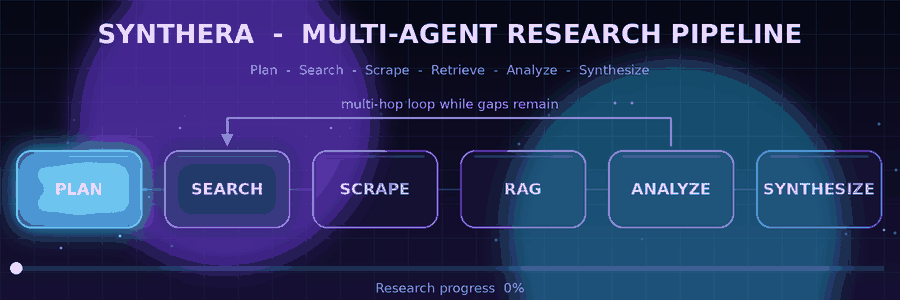

<div align="center">



# Synthera

**Multi-Agent Research &amp; Intelligence Platform**

Ask one question. Synthera plans the investigation, searches the web, reads the sources, reasons across the gaps, and returns a fully cited report — automatically.

<br>

[](https://www.python.org/downloads/)
[](https://fastapi.tiangolo.com)
[](https://github.com/langchain-ai/langgraph)
[](https://streamlit.io)
[](https://www.trychroma.com)
[](LICENSE)

[Overview](#overview) &nbsp;|&nbsp; [Pipeline](#the-research-pipeline) &nbsp;|&nbsp; [Features](#features) &nbsp;|&nbsp; [Architecture](#architecture) &nbsp;|&nbsp; [Quick Start](#quick-start) &nbsp;|&nbsp; [API](#api-reference) &nbsp;|&nbsp; [Configuration](#configuration)

</div>


## Overview

**Synthera** is a production-ready research engine built from a team of cooperating language-model agents. It turns a single research question into a structured investigation and a finished, sourced report. Behind the scenes it behaves like a small research desk:

- **Plans** the work by decomposing the question into focused, non-overlapping sub-queries.
- **Searches** the open web across Tavily or SerpAPI.
- **Scrapes** and cleans the full text of every relevant source.
- **Indexes** the gathered knowledge in a vector store for precise retrieval.
- **Analyzes** the results, detects gaps, and decides whether another research hop is worthwhile.
- **Synthesizes** a comprehensive report with inline citations and follow-up questions.

The workflow is orchestrated by **LangGraph**, traced end to end by **LangSmith**, served through **FastAPI**, and driven by a polished **Streamlit** interface.


## The Research Pipeline

<div align="center">

</div>

Every stage streams its state back to the interface, so you can watch the investigation unfold in real time.

<div align="center">

</div>

The engine runs in **cycles**. After the first pass, the **Analyze** step inspects what has been collected, identifies what is still missing, and either loops back for another search round or moves on to write the report. The number of cycles is fully configurable.


## Features

| Capability | What it does |
|:-----------|:-------------|
| **Multi-Hop Research** | Iterative search, scrape, and analyze cycles that go far beyond a single query |
| **Configurable Depth** | Quick, Moderate, and Comprehensive presets with adjustable hop limits |
| **Grounding with RAG** | A ChromaDB vector store indexes source content for accurate, context-aware writing |
| **Cited Reports** | Inline citations and a complete reference list back every claim |
| **PDF Export** | Professional paginated PDFs with title pages and formatted references |
| **Live Progress** | Real-time phase tracking streamed straight into the interface |
| **Full Observability** | LangSmith traces every model call, tool use, and agent decision |
| **Async by Design** | Non-blocking research execution with background task management |
| **One-Command Deploy** | Docker Compose brings up the API, the interface, and the vector store together |


## Architecture

<div align="center">

</div>

The platform is organized into four cooperating layers:

- **Interface** — a Streamlit app for asking questions, following progress, and reading or exporting reports.
- **Service** — a FastAPI backend exposing async research endpoints, status polling, and PDF generation.
- **Orchestration** — a LangGraph state machine routing work through planning, search, scraping, retrieval, analysis, and synthesis.
- **Intelligence** — external providers for web search, reasoning, embeddings, and observability.

### Agents at a glance

| Component | Responsibility |
|:----------|:---------------|
| `researcher` | Strategic planning and gap analysis — turns one question into targeted sub-queries |
| `search` | Provider-agnostic web search with URL de-duplication |
| `scraper` | Concurrent fetching and cleaning of source documents |
| `rag` | Chunking, embedding, indexing, and context retrieval over ChromaDB |
| `synthesizer` | Report generation with citations, references, and follow-up questions |
| `graph` | LangGraph orchestration and conditional multi-hop routing |

A deeper write-up lives in [`docs/architecture.md`](docs/architecture.md).


## Tech Stack

<div align="center">

| Layer | Technology |
|:------|:-----------|
| Orchestration | LangGraph |
| Reasoning model | OpenAI GPT-4o |
| Embeddings | OpenAI text-embedding-3-small |
| Web search | Tavily or SerpAPI |
| Scraping | BeautifulSoup, httpx, lxml |
| Vector store | ChromaDB |
| Backend | FastAPI and Uvicorn |
| Interface | Streamlit |
| Observability | LangSmith |
| PDF export | fpdf2 |
| Packaging | Docker and Docker Compose |

</div>


## Quick Start

### Prerequisites

- Python 3.10 or newer
- An OpenAI API key
- A Tavily API key (or a SerpAPI key)
- Optional: a LangSmith API key and Docker

### 1 — Clone and install

```bash
git clone https://github.com/sumansingh20/Synthera-AI.git
cd Synthera-AI

python -m venv venv
source venv/bin/activate        # Windows: venv\Scripts\activate

pip install -r requirements.txt
```

### 2 — Configure the environment

```bash
cp .env.example .env
```

Open `.env` and set at minimum:

```env
OPENAI_API_KEY=your_openai_api_key
TAVILY_API_KEY=your_tavily_api_key
```

### 3 — Run Synthera

Using Make:

```bash
make run
```

Or run the services separately:

```bash
# Terminal 1 — Backend
uvicorn synthera.api.main:app --host 0.0.0.0 --port 8000 --reload

# Terminal 2 — Interface
streamlit run frontend/app.py --server.port 8501
```

Or with Docker:

```bash
docker-compose up --build
```

### 4 — Open the app

| Service | URL |
|:--------|:----|
| Interface | http://localhost:8501 |
| API | http://localhost:8000 |
| Swagger docs | http://localhost:8000/docs |
| ReDoc | http://localhost:8000/redoc |


## API Reference

### Start a research task

```bash
curl -X POST http://localhost:8000/api/v1/research/start \
  -H "Content-Type: application/json" \
  -d '{
    "query": "What are the latest advances in quantum computing?",
    "depth": "comprehensive",
    "max_hops": 3
  }'
```

### Poll status

```bash
curl http://localhost:8000/api/v1/research/status/{task_id}
```

### Fetch the result

```bash
curl http://localhost:8000/api/v1/research/result/{task_id}
```

### Export a PDF

```bash
curl -X POST http://localhost:8000/api/v1/research/export-pdf \
  -H "Content-Type: application/json" \
  -d '{"task_id": "your-task-id"}'
```

The complete reference lives in [`docs/api-reference.md`](docs/api-reference.md), or browse `/docs` while the server is running.


## Configuration

All settings are read from environment variables (`.env`):

| Variable | Default | Description |
|:---------|:--------|:------------|
| `OPENAI_API_KEY` | — | OpenAI API key (required) |
| `OPENAI_MODEL` | `gpt-4o` | Model used by the agents |
| `TAVILY_API_KEY` | — | Tavily search key |
| `SERPAPI_API_KEY` | — | SerpAPI key (alternative provider) |
| `LANGCHAIN_TRACING_V2` | `true` | Enable LangSmith tracing |
| `LANGCHAIN_API_KEY` | — | LangSmith API key |
| `LANGCHAIN_PROJECT` | `synthera` | LangSmith project name |
| `DEFAULT_RESEARCH_DEPTH` | `comprehensive` | Default research depth |
| `MAX_HOPS` | `3` | Maximum search-analyze cycles |
| `MAX_SEARCH_RESULTS` | `10` | Results retrieved per query |
| `CHUNK_SIZE` | `1000` | RAG chunk size in characters |
| `CHUNK_OVERLAP` | `200` | RAG chunk overlap |


## Project Structure

```text
Synthera-AI/
├── synthera/
│   ├── agents/              # LangGraph agents
│   │   ├── graph.py         # Workflow orchestration
│   │   ├── researcher.py    # Query planner and gap analyzer
│   │   ├── scraper.py       # Web content scraper
│   │   ├── synthesizer.py   # Report generator
│   │   └── states.py        # State definitions
│   ├── tools/               # External integrations
│   │   ├── search.py        # Tavily and SerpAPI abstraction
│   │   └── pdf_export.py    # PDF report generation
│   ├── rag/                 # Retrieval-augmented generation
│   │   ├── embeddings.py    # Embedding configuration
│   │   ├── vectorstore.py   # ChromaDB management
│   │   └── retriever.py     # Store and retrieve node
│   ├── api/                 # FastAPI backend
│   │   ├── main.py          # App entry point
│   │   ├── routes/          # API endpoints
│   │   ├── models/          # Pydantic schemas
│   │   └── middleware/      # CORS and friends
│   ├── config/              # Settings management
│   └── utils/               # Logging and helpers
├── frontend/                # Streamlit interface
│   ├── app.py               # Main app
│   ├── components/          # UI components
│   └── assets/              # Styles
├── assets/                  # Branding and diagrams
├── tests/                   # Test suite
├── docs/                    # Documentation
├── scripts/                 # Developer scripts
├── docker-compose.yml
├── Dockerfile
├── Makefile
├── pyproject.toml
└── requirements.txt
```


## Testing

```bash
make test        # run the full suite
make test-cov    # run with an HTML coverage report
pytest tests/test_tools/test_helpers.py -v   # a single module
```


## Observability

When `LANGCHAIN_TRACING_V2=true` and a valid `LANGCHAIN_API_KEY` is present, every agent invocation, model call, and tool execution is traced. This makes it easy to inspect exact prompts and responses, track latency and token usage, and compare report quality across configurations. Traces appear at [smith.langchain.com](https://smith.langchain.com).


## Docker Deployment

```bash
docker-compose up --build -d     # build and start everything
docker-compose logs -f           # follow logs
docker-compose down              # stop the stack
```

Services:

- `api` — FastAPI backend on port `8000`
- `frontend` — Streamlit interface on port `8501`
- `chromadb` — vector store on port `8100`


## Development

```bash
pip install -e ".[dev]"   # install with developer tooling

make lint                 # ruff and mypy
make format               # auto-format
make clean                # remove caches and build artifacts
```


## License

Released under the MIT License. See [LICENSE](LICENSE) for details.

<div align="center">
<br>
<sub>Built with LangGraph | FastAPI | Streamlit | ChromaDB | LangSmith</sub>
</div>
